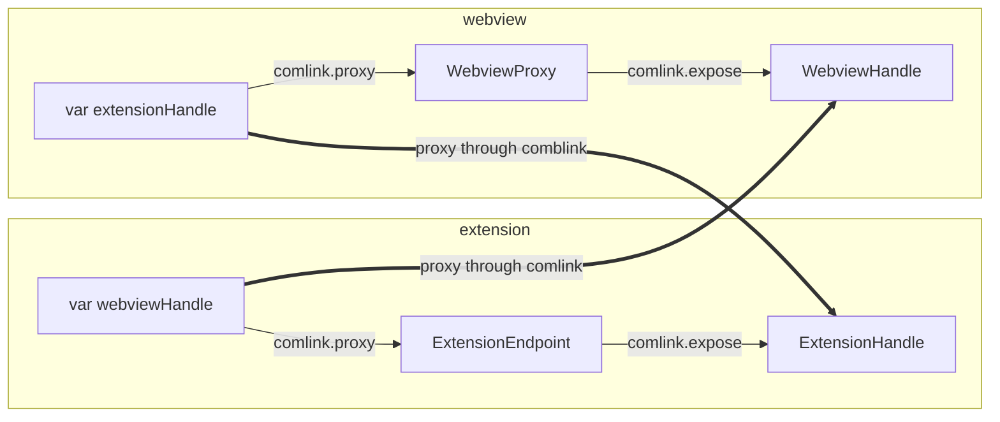

# extension 和 webview 之间的消息传递

插件[vscode-mdx-preview](./start)

## contents

## `comlink` API

使用了较老版本的 [`@dxflow/comlinkjs`](https://www.npmjs.com/package/@dxflow/comlinkjs) API，新版本 [`comlink`]() API 更细化和完善，。

- `Comlink.proxy(endpoint)`

  Returns the value that is exposed on the other side of endpoint.

- `Comlink.expose(obj, endpoint)`

  Exposes obj to endpoint. Use Comlink.proxy on the other end of endpoint.

## 调用关系



## webview 调用 extension api

<CH.Scrollycoding rows={60}>

1. `Endpoint` 协议定义了 主线程与 worker 线程的消息通信 [API](https://developer.mozilla.org/en-US/docs/Web/API/Worker)。

```ts
export interface Endpoint {
  postMessage(message: any, transfer?: any[]): void;
  addEventListener(
    type: string,
    listener: EventListenerOrEventListenerObject,
    options?: {}
  ): void;
  removeEventListener(
    type: string,
    listener: EventListenerOrEventListenerObject,
    options?: {}
  ): void;
}
```

---

2. extension 端，`ExtensionEndpoint` 实现了 `Endpoint` 协议，可以模拟 web worker API 与 webview 通信。

```ts initRPCExtensionSide focus=3
// from /Users/jinmao/code/mdx/vscode-mdx-preview/packages/extension/rpc-extension.ts 9:19
```

---

3. extension 端，`ExtensionHandle` 实现了 `handshake()`, `reportPerformance()`, `fetch()` 。

```ts ExtensionHandle focus=1,7,11,17
// from /Users/jinmao/code/mdx/vscode-mdx-preview/packages/extension/rpc-extension-handle.ts 6:25
```

---

4. 在 extension 端，`comlink.expose` 将`ExtensionHandle` 暴露在了 `ExtensionEndpoint` 上。

```ts initRPCExtensionSide focus=3,5:7
// from /Users/jinmao/code/mdx/vscode-mdx-preview/packages/extension/rpc-extension.ts 68:79
```

---

5. 在 webview 端, `WebviewProxy` 对象实现了 `Endpoint` 协议，可以与 extension 通信。

```ts rpc-webview-handle focus=4,12
// from /Users/jinmao/code/mdx/vscode-mdx-preview/packages/webview-app/src/rpc-webview.ts 6:17
```

---

6. 在 webview 端，`comlink.proxy` 代理了 `WebviewProxy`, 实际上是通过 comlink 代理了 `ExtensionHandle`

```ts rpc-webview.ts focus=4,5
// from /Users/jinmao/code/mdx/vscode-mdx-preview/packages/webview-app/src/rpc-webview.ts 20:31
```

---

7. 在 webview 端，可以直接调用 `ExtensionHandle.fetch` 返回的异步结果（`Promise`）

```ts rpcFetcher focus=1,20,43
// from /Users/jinmao/code/mdx/vscode-mdx-preview/packages/webview-app/src/evaluate.ts 9:55
```

</CH.Scrollycoding>

## extension 调用 webview api

<CH.Code>
```ts rpc-webview.ts focus=2,7:9
// from /Users/jinmao/code/mdx/vscode-mdx-preview/packages/webview-app/src/rpc-webview.ts 20:31
```

```ts rpc-extension.ts focus=1,8:9
// from /Users/jinmao/code/mdx/vscode-mdx-preview/packages/extension/rpc-extension.ts 69:79
```

```ts preview/evaluate-in-webview.ts focus=14,29
// from /Users/jinmao/code/mdx/vscode-mdx-preview/packages/extension/preview/evaluate-in-webview.ts
```

</CH.Code>
